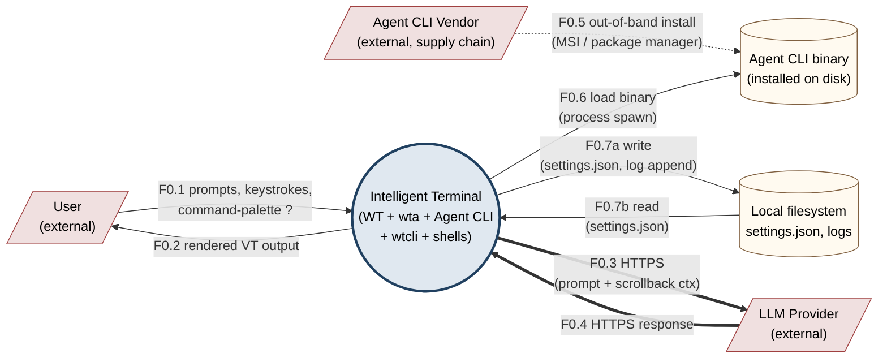
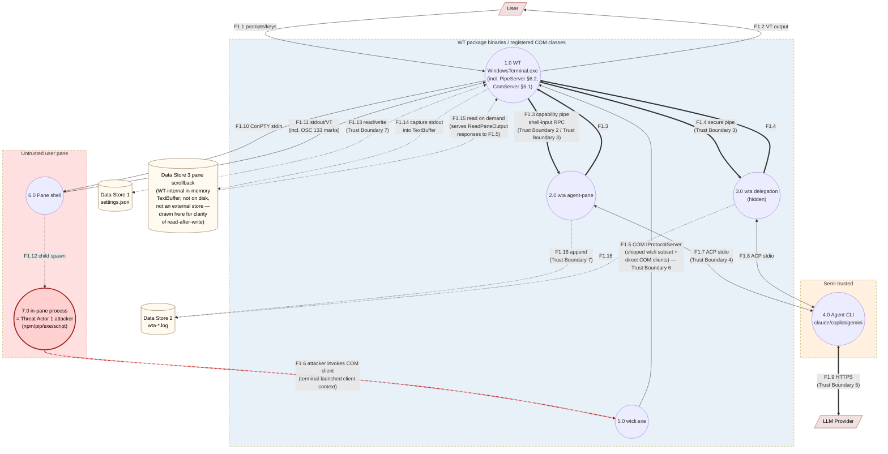
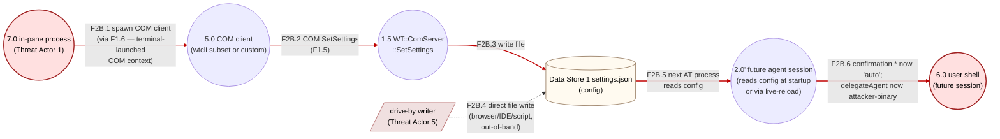

# Intelligent Terminal — Security Model & Threat Analysis

| Field | Value |
|---|---|
| **Document status** | Draft v1.0 |
| **Last updated** | 2026-05-11 |
| **Audience** | Microsoft internal security review |
| **Authors** | Intelligent Terminal team |
| **Component** | Windows Terminal fork with embedded AI agents (WT + WTA + WTCLI) |

---

## 1. Executive Summary

Intelligent Terminal is a fork of Windows Terminal that embeds AI assistants (Copilot, Claude, Gemini, custom agents) into the user's terminal workflow. The defining capability — and the dominant security concern — is that AI agents can **drive the user's shells**: they can read pane scrollback, type commands into other panes, open new tabs and panes, and modify settings.

This document analyses the threat model for that capability surface. The primary attacker classes are (a) **in-pane processes** that the user accidentally launches (malicious npm packages, scripts, exes), (b) **prompt-injection** of the LLM via untrusted content the agent reads (a website, a log, a `cat`'d file), and (c) **third-party agent CLIs** (`claude`, `copilot`, `codex`, `gemini`) that we treat as semi-trusted black boxes.

The security model is built around two WT control planes: a **terminal-scoped COM surface** gated by Windows packaged-COM / terminal activation policy, and a **per-wta capability pipe** gated by inherited kernel handles. Operations that can drive a shell or persistently change agent behaviour need capability-style authorization. COM remains the dominant residual surface because code launched inside an Intelligent Terminal pane can activate it, but ordinary external callers and arbitrary same-package contexts were experimentally denied.

The remaining sections enumerate trust boundaries, assets, threat actors, and a STRIDE table per component.

---

## 2. System Overview

### 2.1 Components

| Component | Process | Identity | Lives where |
|---|---|---|---|
| **WT** (`WindowsTerminal.exe`) | Long-lived UI host | Packaged (AppContainer-eligible) | One per user session (or per window group) |
| **WTA** (`wta.exe`) | TUI agent / orchestrator (Rust) | Packaged (co-located with WT) | At most **one persistent agent-pane wta** per `TerminalPage` (the "single shared agent pane" — see `TerminalPage::_agentPane`, `_FindAgentPane`); plus **one short-lived hidden wta per `?<prompt>` delegation** (concurrent delegations allowed) |
| **Agent CLI** | Third-party LLM client (`claude`, `copilot`, `gemini`, `codex`, custom) | User-installed binary | Spawned by WTA, child of WTA |
| **WTCLI** (`wtcli.exe`) | CLI client to WT protocol | Packaged | Package-private CLI client. Direct launch from an ordinary external process is denied by WindowsApps/package policy. Reads `WT_COM_CLSID` env var as a branding-routing hint — **not** a security gate (CLSID is hardcoded per branding in source) |
| **TerminalProtocolComServer** | Out-of-proc COM server, MTA thread | Inside WT, co-marshalled via MBM | Per WT process |
| **TerminalProtocolPipeServer** | Per-wta JSON-RPC IO thread | Inside WT (TerminalApp.dll) | One per launched wta |

### 2.2 Communication Channels

| Channel | Endpoints | Transport | Security control today |
|---|---|---|---|
| **C-COM** | wtcli ↔ WT | COM `IProtocolServer` (CLSCTX_LOCAL_SERVER); CLSID is hardcoded per branding in `TerminalProtocolComServer.h` and **is not a secret** | Windows packaged-COM / terminal activation policy before method execution. Verified: ordinary external callers and arbitrary same-package contexts are denied; Intelligent Terminal pane children are allowed. `WT_COM_CLSID` env var is a discovery / branding-routing hint only |
| **C-PIPE** | wta ↔ WT | Anonymous duplex pipe pair, JSON-RPC 2.0 over 4-byte LE length frames | **Kernel handle inheritance** (PROC_THREAD_ATTRIBUTE_HANDLE_LIST) |
| **C-ACP** | wta ↔ Agent CLI | JSON-RPC 2.0 over stdio (Agent Control Protocol) | Process tree (parent/child); `_writeOverlapped` event isolation |
| **C-NET** | Agent CLI ↔ LLM provider | HTTPS (out of our control) | Provider-managed (API keys, TLS) |
| **C-VT** | shell ↔ WT | OSC sequences in PTY output stream (e.g. OSC 133, OSC 9001) | None — content of the stream is not authenticated |
| **C-FS** | All ↔ disk | settings.json, log files | NTFS ACLs (per-user packaged sandbox) |

### 2.3 Process Tree (typical)

```
WindowsTerminal.exe                                  (packaged)
├── ConPTY → user shell (PowerShell, bash, …)        (one per user pane; many)
├── ConPTY → wta.exe (the agent pane)                (AT MOST ONE per TerminalPage,
│   └── claude.exe / copilot.exe / …                  wta owns PIPE_R/W; child should not)
└── (hidden) wta.exe delegate …                      (zero or more; one per
    └── claude.exe / …                                ?<prompt>; short-lived)
```

**Cardinality clarification.** Per WT `TerminalPage` (≈ per WT window), there is **at most one** persistent wta — the "single shared agent pane" managed via `TerminalPage::_agentPane` (a `weak_ptr<Pane>`, not a collection). Subsequent calls to `_OpenOrReuseAgentPane` find the existing pane via `_FindAgentPane()` and reuse it. Multi-window scenarios (multiple `TerminalPage` instances under one `WindowEmperor`) can produce one persistent wta per window, but each window's wta is independent.

### 2.4 DFDs — overview

This document uses three levels of Data-Flow Diagram

| Level | Purpose |
|---|---|
| **Level 0** (§2.5) | Context diagram — system as a single process, all external actors and data stores |
| **Level 1** (§2.6) | System DFD — every internal process, every cross-boundary data flow, all trust boundaries drawn |
| **Level 2** (§2.7, §2.8) | Per-critical-area decomposition — shell input routing and settings.json mutation surface |

DFD symbol convention: **circles** are processes (we use rounded boxes in Mermaid for compatibility), **rectangles** are external entities, **cylinders** are data stores, **dashed boxes** are trust boundaries, **arrows** are data flows. Data-flow labels such as `F1.3` mean "Flow in diagram level 1, sequence 3"; these labels are diagram coordinates, not security finding identifiers.

**Identifier convention.** This document avoids short security identifiers. Threat rows use explicit names such as `COM Threat 3`, `WTCLI Threat 3`, `Pipe Threat 1`, and `Settings Threat 1`. Summary risks use `Residual Risk 1`, `Residual Risk 2`, etc. Controls use `Mitigation 1`, `Mitigation 2`, etc. Trust boundaries, threat actors, assets, and data stores are also written out in full. Top-level processes still use numeric diagram IDs (`1.0` WT, `2.0` wta agent-pane, `3.0` wta delegation, `4.0` Agent CLI, `5.0` wtcli, `6.0` pane shell, `7.0` in-pane process) because those labels exist only inside the diagrams.

If your viewer does not render Mermaid, the diagrams below can be exported with `mmdc -i security-model.md -o ./images/`.

### 2.5 Level 0 — Context diagram



**Reading the L0:** the system has three external trust counterparties — the User (trusted), the LLM Provider (semi-trusted, sees prompts), and the Agent CLI Vendor (semi-trusted, supplies the binary that interprets LLM output). The double-line arrows (F0.3, F0.4) cross the most security-relevant external boundary: HTTPS to a third-party LLM, where prompt content (which can contain pane scrollback) leaves the host.

### 2.6 Level 1 — System DFD



**Reading the L1.** Three trust zones, color-coded:

- **Blue (WT package binaries / registered COM classes):** packaged binaries and COM registrations owned by Intelligent Terminal. The pipe transport (F1.3, F1.4) crosses **inside** this zone via kernel handle inheritance — capability cannot be regranted, see §7.1.
- **Tan (semi-trusted):** the Agent CLI runs as wta's child but is third-party code. ACP (F1.7, F1.8) crosses Trust Boundary 4. Network egress (F1.9) crosses Trust Boundary 5.
- **Red (untrusted user pane):** the user's shell and any process it spawns. F1.6 is the terminal-scoped COM attack path: an in-pane process does **not** inherit package identity in our tests, but it does receive `WT_COM_CLSID` and can activate the Intelligent Terminal COM classes when launched as a pane child. The CLSID is hardcoded per branding and publicly known; `WT_COM_CLSID` env var is just a routing hint, **not the gate**. COM still has F1.5 for reads and several mutations; shell input is routed over the per-wta capability pipe instead.

**Key observation visible in the diagram:** the **scrollback exfiltration / prompt-injection chain** is:

```
F1.11 (shell stdout)
  → F1.14 (WT captures into Data Store 3 TextBuffer)
  → F1.5 (wta-spawned wtcli requests ReadPaneOutput via COM)
  → F1.15 (Data Store 3 read on demand, response over F1.5 reverse)
  → wtcli stdout pipe → wta
  → F1.7 (wta forwards as prompt context over ACP)
  → F1.9 (Agent CLI HTTPS to LLM)
```

Anything an in-pane process echoes (F1.11) can:
1. Reach the LLM as prompt context (above chain) — **information disclosure**
2. Become an instruction the LLM follows, returned as a shell-input request over F1.3 — **prompt-injection (Residual Risk 2 in §10)**

Note that scrollback retrieval **today goes through wtcli/COM** (CliChannel routes `read_pane_output` to `wtcli capture-pane`); it does **not** flow over the per-wta capability pipe. Mitigation 2's read-method migration would move it.

### 2.7 Level 2 — Shell Input Data Path

Refines F1.3/F1.4 from the L1, showing how agent-originated shell input traverses WT.

```mermaid
flowchart LR
    Attacker[/"untrusted content<br/>(in scrollback / web / file<br/>read by Agent CLI)"/]
    LLM[/LLM Provider/]
    ACLI(("4.0 Agent CLI"))
    WTA(("2.0 wta<br/>RoutedChannel"))
    PipeSrv(("1.1 WT::PipeServer<br/>(IO thread)"))
    TermPage(("1.2 WT::TerminalPage<br/>input router"))
    TermCtl(("1.3 WT::TermControl<br/>input API"))
    Core(("1.4 WT::ControlCore<br/>connection writer"))
    Shell[("DS:<br/>shell stdin<br/>via ConPTY")]

    Attacker -. "F2A.1 reaches LLM as<br/>injected instruction" .-> LLM
    LLM == "F2A.2 (F0.4) ACP-shaped<br/>response: 'send dir to target pane'" ==> ACLI
    ACLI -- "F2A.3 (F1.7) ACP req<br/>{action:'send', parent:'<WT_SESSION>', input:'dir'}" --> WTA
    WTA == "F2A.4 (F1.3) JSON-RPC frame<br/>shell-input method<br/>over inherited pipe" ==> PipeSrv
    PipeSrv -- "F2A.5 dispatch<br/>(UI dispatcher)" --> TermPage
    TermPage -- "F2A.6 find pane by<br/>SessionId tree-walk" --> TermCtl
    TermCtl -- "F2A.7 forward input" --> Core
    Core -- "F2A.8 _connection.WriteInput<br/>(read-only check)" --> Shell

    classDef ext fill:#f0e0e0,stroke:#a04040,color:#000
    classDef ds fill:#fffaf0,stroke:#806040,color:#000
    classDef pipe stroke-dasharray:5 5,stroke-width:3px,fill:#fff8e0,color:#000
    class Attacker,LLM ext
    class Shell ds
    class WTA,PipeSrv pipe

    linkStyle 3 stroke:#c00000,stroke-width:3px
```



**Where the security guarantees apply:**

| Step | Guarantee | Source |
|---|---|---|
| F2A.4 (the bold red flow) | Capability-bound: only a process that **inherited** the pipe handles can send this frame. An attacker that can only activate COM, including an in-pane process in an allowed terminal-launched COM context, cannot forge this — the handle is kernel-verified per-process. | §7.1, Mitigation 1, Mitigation 4 |
| F2A.5 | Method allow-list enforced — the pipe server accepts only the handshake and shell-input method today. | §6.2 Pipe Threat 6 |
| F2A.6 | `session_id` is parsed as a GUID and matched with `Pane::FindPaneBySessionId`; non-existent or wrong-process panes fail closed. | §6.2 Pipe Threat 8 |
| F2A.8 | `ControlCore` honours the read-only mode flag before writing to the connection; pane-level lockout still applies. | §6.2 Pipe Threat 8 |

**Where the security guarantees do NOT apply** (residual): F2A.1 — F2A.4 itself. If the LLM is prompt-injected and the user has `aiIntegration.confirmation.inputOperations = auto`, the injected shell-input request reaches F2A.5 with full authorization. This is Residual Risk 2 in §10; mitigations are Mitigation 11, Mitigation 12, and Mitigation 13.

### 2.8 Level 2 — settings.json mutation path (current threat — Residual Risk 3)

Refines F1.5/F1.13 from the L1, showing the persistent elevation-of-privilege loop behind the highest-priority residual architecture risk.



**Why this is Residual Risk 3 / high-priority residual risk:** the chain F2B.1 → F2B.6 is **not gated by user confirmation today**. Stock `wtcli.exe` does not expose `SetSettings`, but the COM method itself is still callable by a custom client in the allowed terminal-launched context; an in-pane attacker can persistently change future agent behaviour. Mitigation 2 aligns settings writes with the per-wta capability model instead of the COM model. Mitigation 7 (require confirmation for confirmation-policy edits — meta-confirmation) is a secondary backstop that helps even before Mitigation 2 lands.

---

## 3. Trust Boundaries

Boundaries are referenced from §2.6 (Level 1 DFD) and §6 (STRIDE tables).

| Identifier | Boundary | L1 flows that cross it | Enforcement |
|---|---|---|---|
| **Trust Boundary 1** | WT ↔ in-pane shell | F1.10, F1.11 | ConPTY isolation; parent-child relationship; WT propagates terminal environment such as `WT_SESSION`, `WT_PROFILE_ID`, and optionally `WT_COM_CLSID`; pane child did not inherit package identity in tests |
| **Trust Boundary 2** | WT ↔ WTA (agent-pane) | F1.3 | **Kernel handle inheritance via STARTUPINFOEX HANDLE_LIST**; wt-side handles non-inheritable; wta strips `HANDLE_FLAG_INHERIT` at startup |
| **Trust Boundary 3** | WT ↔ WTA (delegation, hidden) | F1.4 | Same as Trust Boundary 2 |
| **Trust Boundary 4** | WTA ↔ Agent CLI | F1.7, F1.8 | Parent-child stdin/stdout; no auth (we own the spawn) |
| **Trust Boundary 5** | Agent CLI ↔ LLM | F1.9 | TLS, provider's API key auth — not our concern, but user data leaves the host here |
| **Trust Boundary 6** | WT ↔ wtcli / direct COM callers of `IProtocolServer` | F1.5, F1.6 | Windows packaged-COM / COM security policy before method execution. The CLSID is hardcoded per branding in source and is publicly known; `WT_COM_CLSID` env var is a branding-routing hint, not a security control. Verified caller set: ordinary external callers and arbitrary same-package contexts are denied; Intelligent Terminal pane children are allowed. |
| **Trust Boundary 7** | All ↔ on-disk filesystem (settings.json, logs) | F1.13, F1.16 | NTFS ACLs (packaged sandbox redirects). Data Store 3 (scrollback) is **in-memory inside WT and does not cross Trust Boundary 7** — F1.14 / F1.15 are intra-process. |
| **Trust Boundary 8** | wta ↔ wta's grandchildren | (intra-process: between `WT_PROTOCOL_PIPE_R/W` env-read and child spawn in wta) | wta's spawn flags (no `HANDLE_FLAG_INHERIT` on pipe handles after `from_env`) |

**Critical observation (Trust Boundary 6):** `IProtocolServer` is not globally callable by any packaged app. On IntelligentTerminal 0.7.0.8 ARM64, ordinary external PowerShell and arbitrary same-package PowerShell both receive `E_ACCESSDENIED`, while a process launched inside an Intelligent Terminal pane can activate the Dev COM class even though `GetCurrentPackageFullName` reports no package identity. The app-level risk boundary is therefore **terminal-launched pane context**, not package identity. The `WT_COM_CLSID` env var that wtcli reads is just a branding-routing hint; it is not a secret and it is not a gate. **This is the dominant terminal-scoped COM control surface.**

---

## 4. Assets and Sensitivity

| Identifier | Asset | Sensitivity | Notes |
|---|---|---|---|
| **Asset 1** | User shell stdin (i.e. ability to execute commands as the user) | Critical | Agent-originated input and `CreateTab/SplitPane` with arbitrary `commandline` touch this directly or indirectly |
| **Asset 2** | `settings.json` | Critical | Modifying it can change `acpAgent`, `delegateAgent`, `aiIntegration.confirmation.*`, `aiIntegration.coordinator.commandline` — ⇒ persistent privilege escalation for any future AI session |
| **Asset 3** | Pane scrollback content | Sensitive | Often contains echoed tokens, API keys, session cookies, source code, file contents from `cat`, `Get-Content`, etc. Read by `ReadPaneOutput`. Major exfiltration channel via Trust Boundary 5 (LLM provider) |
| **Asset 4** | Process environment variables (current pane) | Sensitive | Includes `WT_COM_CLSID`, possibly customer API keys |
| **Asset 5** | Active session VT streams (OSC 133 marks, exit codes, prompt boundaries) | Internal | Used by Autofix; leak signals shell behaviour but not data |
| **Asset 6** | Pane / tab / window topology | Internal | Reconnaissance: which PIDs are in which pane |
| **Asset 7** | Log files (`wta-*.log`) | Sensitive | Contains agent prompts, partial responses, command lines. May contain token-shaped strings echoed by user |
| **Asset 8** | Inherited pipe HANDLE values (`WT_PROTOCOL_PIPE_R/W` env vars in wta) | Sensitive | If leaked into a grandchild process, that process gains the per-wta shell-control capability |

---

## 5. Threat Actors

| Identifier | Actor | Capability | Motivation |
|---|---|---|---|
| **Threat Actor 1** | **In-pane process** (malicious npm/pip/exe/script run by the user) | Read env, spawn children, network access, full user-mode privilege; receives `WT_COM_CLSID` and can activate the Intelligent Terminal COM class when launched as a pane child. It did **not** have package identity in tests. Direct external launch of package-private `wtcli.exe` is denied, but a custom in-pane COM client can still attack the COM surface. | Lateral movement into other panes, persistence, exfiltration |
| **Threat Actor 2** | **Prompt-injected LLM** (LLM follows instructions hidden in untrusted content the agent reads — webpage, log, file) | Whatever the agent CLI lets it do — request shell input, pane creation, etc. | Cause agent to run attacker-chosen commands |
| **Threat Actor 3** | **Compromised Agent CLI binary** | Full process privilege of wta's child | Run anything wta is willing to drive |
| **Threat Actor 4** | **Co-resident user / process** (multi-user box; a less-privileged process trying to escalate) | Other-user-level access to %LOCALAPPDATA% redirected paths | Read logs, read settings.json |
| **Threat Actor 5** | **Drive-by `settings.json` modifier** (browser download, clipboard injection, msedge handoff that writes the file) | Filesystem write to the settings file path | Persistent agent behaviour change |
| **Threat Actor 6** | **Stale CLSID / vtable client** (older wtcli or third-party caller against new IDL) | COM client with stale projection | Mostly DoS / accidental misuse, not adversarial |

Out of scope: kernel exploits, supply-chain compromise of WT itself, malicious user, physical access.

---

## 6. STRIDE — Per Component

The following sections enumerate threats per component using the standard STRIDE categories: Spoofing, Tampering, Repudiation, Information disclosure, Denial of service, and Elevation of privilege.

Severity is on a 4-point scale: **Critical / High / Medium / Low**.
Each row links to a mitigation in Section 9.

### 6.1 `IProtocolServer` (COM, in WT) — `TerminalProtocolComServer`

Activated via `CoCreateInstance(CLSCTX_LOCAL_SERVER)` against a **per-branding hardcoded CLSID** (see `TerminalProtocolComServer.h` — 4 fixed UUIDs by branding). The `WT_COM_CLSID` env var WT advertises is a discovery convenience for multi-branding scenarios; **the CLSID is publicly known and is not a security gate**. Activation before method execution is controlled by Windows packaged-COM / COM security policy, not by Intelligent Terminal code. On the tested IntelligentTerminal 0.7.0.8 ARM64 build, ordinary external callers and arbitrary same-package contexts are denied, while Intelligent Terminal pane children are allowed. **Authentication is currently a `dev bypass`** (any token accepted; see `Authenticate(token)` impl), and most COM methods do not currently require `_authenticated`; only event subscription / publishing paths enforce it.

| Identifier | STRIDE category | Threat | Severity | Mitigation |
|---|---|---|---|---|
| COM Threat 1 | Spoofing | Any caller in an allowed terminal-launched COM context can spoof a legitimate caller (CLSID is publicly known; no caller-PID/identity check; `Authenticate` is a dev-bypass and is not enforced by most methods). In-pane processes are the verified attacker context. | **High** | Mitigation 1, Mitigation 2 (partial), Mitigation 9 |
| COM Threat 2 | Tampering | `SetSettings(content)` lets a caller overwrite `settings.json` (replacing `acpAgent`, changing `confirmation.*` policy, enabling Autofix) | **Critical** | Mitigation 2 (planned), Mitigation 7 |
| COM Threat 3 | Tampering / Elevation of privilege | `CreateTab` / `SplitPane` accept arbitrary `commandline` → arbitrary process spawn as a child of WT. **Three distinct cases:** (a) **Same-integrity WT**: an allowed in-pane COM caller can create background tabs/panes under the user's current token. This is persistence / detection-evasion, not privilege gain. (b) **Already-admin WT**: if the user launched WT elevated, an attacker already running inside an admin WT pane can create additional admin child processes through WT. This is stealthy admin persistence, not a new elevation of privilege because the caller is already admin. (c) **Unverified cross-integrity case**: if a medium-integrity caller can activate an elevated WT COM server, then `CreateTab` / `SplitPane` becomes direct elevation of privilege. This must be tested because WT does not call `CoInitializeSecurity`. A separate **user-assisted elevation of privilege** exists if the caller selects an elevated profile and the user accepts the User Account Control prompt. | **Critical only for cross-integrity or user-accepted elevation; otherwise High** | Mitigation 2 (planned), Mitigation 7 |
| COM Threat 4 | Tampering | `SetSessionVariable(sessionId, name, value)` mutates WT's per-pane in-memory session-variable map. It does **not** write environment variables into the already-running shell, but it can tamper with WT/agent metadata if future flows trust those variables. | **Medium** | Mitigation 2 (planned), Mitigation 7 |
| COM Threat 5 | Repudiation | No authenticated caller identity; SetSettings creates a backup but the **action attribution** is "some COM caller in an allowed activation context" — no PID, no name, no chain of custody | **Medium** | Mitigation 3 |
| COM Threat 6 | Information disclosure | `ReadPaneOutput` returns arbitrary scrollback lines including secrets that scrolled through pane | **High** | Mitigation 7, Mitigation 8 |
| COM Threat 7 | Information disclosure | `ListPanes`, `ListTabs`, `GetActivePane` give topology / `Cwd` / `Pid` — useful reconnaissance | **Medium** | Mitigation 2 (caller restriction), Mitigation 7 |
| COM Threat 8 | Information disclosure | `GetSettings` returns the entire `settings.json` (may contain custom commandlines, secrets users put in profiles) | **Medium** | Mitigation 2, Mitigation 7 |
| COM Threat 9 | Denial of service | Repeated interactive COM operations can create user-visible churn. `QuickPick` has a single-active-prompt guard and waits asynchronously, but spammed `CreateTab` / `SplitPane` can still exhaust window resources. | **Medium** | Mitigation 10 |
| COM Threat 10 | Elevation of privilege | Combined: in-pane process → direct COM client → SetSettings to weaken confirmation → next agent action runs unprompted = persistent elevation of privilege | **Critical** | Mitigation 2, Mitigation 7 |

**Note on shell input:** direct shell-input injection is not exposed on this COM interface; it is routed through the per-wta capability pipe. Other COM mutations remain callable from the allowed terminal-scoped COM context and are tracked above.

### 6.2 `TerminalProtocolPipeServer` (per-wta pipe, in WT)

One IO thread per launched wta. Reads JSON-RPC frames and dispatches to a small method allow-list (currently handshake plus shell input). The wt-side handles are owned by `TerminalPage` for the lifetime of the wta process; they are **non-inheritable** (locked at pipe creation via `SetHandleInformation`).

| Identifier | STRIDE category | Threat | Severity | Mitigation |
|---|---|---|---|---|
| Pipe Threat 1 | Spoofing | A grandchild of wta inherits the pipe handles via accidental `bInheritHandles=TRUE` and impersonates wta on the pipe | **High** | Mitigation 4 (HANDLE_FLAG_INHERIT cleared at wta startup), Mitigation 5 |
| Pipe Threat 2 | Spoofing | A wta-side bug duplicates the handle to another process via `DuplicateHandle` | **Medium** | Mitigation 4 (audit comment near `OwnedHandle`), Mitigation 5 |
| Pipe Threat 3 | Tampering | Malformed JSON / oversized frame causes parser/buffer issue | **Low** | Mitigation 6 (4-byte LE length cap, 64 KiB hard limit; jsoncpp bounded parse) |
| Pipe Threat 4 | Tampering | Replay: a captured frame is replayed by an attacker who somehow reaches the pipe | **Low** | (Not directly mitigated — out of threat scope; would require handle leakage to start) |
| Pipe Threat 5 | Repudiation | Shell-input calls aren't logged with caller pid | **Low** | Mitigation 3 (planned: log handshake's reported pid + each shell-input call) |
| Pipe Threat 6 | Information disclosure | A method handler returns more data than caller is authorized for | **Low** | (The current pipe method set does not return sensitive data; future methods need per-method audit) |
| Pipe Threat 7 | Denial of service | wta blocks on a large frame; IO thread back-pressure | **Low** | Mitigation 6 (length caps, blocking ReadFile on a single thread per pipe — a bad client only DoSes its own channel) |
| Pipe Threat 8 | Elevation of privilege | Pipe handler routes shell input to a target pane. If target validation failed, the caller could hit an arbitrary pane. | **Medium** | Implemented: `session_id` must be a non-empty GUID and is matched against `Pane::FindPaneBySessionId`; `ControlCore` enforces read-only mode before writing input |

**Defining property of this surface:** authorization is held in a kernel handle, not a string. There is no "discovery" mechanism — the handle either was inherited at process creation, or it wasn't. Loss of this capability does NOT regrant via env var, registry, COM lookup, or filesystem.

### 6.3 `wtcli.exe`

User-facing CLI that calls `IProtocolServer` via COM. Reads `WT_COM_CLSID` for branding-routing (which CLSID to activate for the running WT), but that variable is **not** an authorization secret. `wtcli.exe` lives inside the package-private WindowsApps directory: direct launch from an ordinary external PowerShell failed with `Access is denied`; launching it inside an arbitrary same-package context via `Invoke-CommandInDesktopPackage` started the binary but COM activation still failed with `0x80070005`. A process launched inside an Intelligent Terminal pane can activate the COM class directly, so the security boundary is the terminal-launched client context rather than the existence of `wtcli.exe` itself.

| Identifier | STRIDE category | Threat | Severity | Mitigation |
|---|---|---|---|---|
| WTCLI Threat 1 | Spoofing | A caller in an allowed terminal-launched COM context can invoke WT protocol operations, either through the supported CLI path or a custom COM client. `WT_COM_CLSID` is **not** a gate. | **High** | Mitigation 1, Mitigation 2 |
| WTCLI Threat 2 | Tampering | `SetSettings` is callable on the COM interface by an allowed COM client. Current `wtcli.exe` does **not** ship a `set-settings` verb, so this is not exposed by the stock CLI, but the server method remains reachable to custom clients in the allowed context. | **High** | Mitigation 2, Mitigation 7 |
| WTCLI Threat 3 | Tampering / Elevation of privilege | `wtcli new-tab -c '<cmdline>'` spawns arbitrary process as a child of WT. New process inherits WT's token (`CreateProcessW` default). In a non-elevated WT, this is same-user process creation and persistence. In an already-admin WT pane, this is admin-level persistence/evasion by code that is already admin. It becomes direct elevation of privilege only if a medium-integrity caller can activate an elevated WT COM server, which is still unverified. See COM Threat 3 for the elevated-profile User Account Control variant. | **Critical only for cross-integrity or user-accepted elevation; otherwise High** | Mitigation 2, Mitigation 7 |
| WTCLI Threat 4 | Information disclosure | `wtcli capture-pane`, `list-panes`, `info` enumerate state for reconnaissance | **Medium** | Mitigation 2, Mitigation 7 |
| WTCLI Threat 5 | Denial of service | `wtcli kill-pane` repeatedly closes panes; can race agent's open-and-send flows | **Low** | (Accepted: pane lifetime is user-controlled; closed pane is immediately observable) |
| WTCLI Threat 6 | Elevation of privilege | Stock `wtcli.exe` has no verb for direct shell-input injection; callers must use wta-mediated automation | n/a | Mitigated (Mitigation 1) |

### 6.4 WTA process (`wta.exe`)

Two flavours: the **single persistent agent-pane wta** (long-lived; at most one per `TerminalPage`, see §2.3), and **short-lived delegation wtas** (one per `?<prompt>`, hidden, concurrent). The binary is packaged and co-located with WT, but shell-control authorization for wta is the inherited pipe handle, not package identity or COM activation.

| Identifier | STRIDE category | Threat | Severity | Mitigation |
|---|---|---|---|---|
| WTA Threat 1 | Spoofing | An attacker spawns `wta.exe` (or any other packaged binary in the package) with `WT_PROTOCOL_PIPE_R/W` set to fake handle values, hoping to bypass the secure-pipe gate | **Medium** | Mitigation 4: the handles must be **actually inherited** kernel handles in *this* process to be valid. Arbitrary numbers fail when `OwnedHandle::from_raw_handle` is used because the kernel handle table doesn't contain them — fails with read EOF / write error; Mitigation 5. (For the COM surface, `WT_COM_CLSID` is **not** a gate per §6.1, so spoofing the env var doesn't grant new capability either.) |
| WTA Threat 2 | Tampering | The Agent CLI returns ACP-shaped data crafted to make wta send attacker-chosen text into a pane | **High** (this is the **prompt-injection root case**) | Mitigation 11 (confirmation gates), Mitigation 12 (insert-only mode), Mitigation 13 (rate limits) |
| WTA Threat 3 | Tampering | Malicious agent CLI binary on PATH | **Medium** | Mitigation 14 (custom commands are explicit; well-known built-in agent IDs can still resolve through PATH / known install locations) |
| WTA Threat 4 | Repudiation | Agent action attribution: was the action driven by the LLM or by the user? | **Medium** | Mitigation 3 (every action logged with prompt context, choice number, recommendation source) |
| WTA Threat 5 | Information disclosure | wta logs (`wta-main.log`, `wta-delegate.log`, etc.) contain the LLM prompt and partial response — can include user input | **Medium** | Mitigation 3 (log rotation), Mitigation 15 (log redaction roadmap) |
| WTA Threat 6 | Information disclosure | Pipe handle values are exposed in `WT_PROTOCOL_PIPE_R/W` env vars at startup. Any code in wta's process **before** they are read can inspect / leak them | **Medium** | Mitigation 4 (`PipeChannel::from_env` consumes the vars via `std::env::remove_var` and immediately strips `HANDLE_FLAG_INHERIT`) |
| WTA Threat 7 | Denial of service | Malformed JSON-RPC frame from WT to wta causes wta to crash | **Low** | wta side has length caps + frame parsing errors are surfaced as `bail!` (transport marked dead, falls back) |
| WTA Threat 8 | Elevation of privilege | wta spawns the Agent CLI with `bInheritHandles=TRUE` and no HANDLE_LIST → leaks pipe handles into the agent CLI process | **High** | Mitigation 4 (defense-in-depth: HANDLE_FLAG_INHERIT cleared at startup; even with bInheritHandles=TRUE the handles do not propagate). Also: requires audit of the spawn site. |

### 6.5 ACP channel (wta ↔ Agent CLI)

stdio JSON-RPC. Agent CLI is wta's child process; we own the spawn parameters.

| Identifier | STRIDE category | Threat | Severity | Mitigation |
|---|---|---|---|---|
| Agent Protocol Threat 1 | Spoofing | A non-child process attaches to wta's stdin/stdout (Win32: hard, requires already-elevated access) | **Low** | OS-level (parent-child handle inheritance; no namespace) |
| Agent Protocol Threat 2 | Tampering | Agent CLI sends ACP messages instructing destructive operations | **High** (the actual Threat Actor 2 surface) | Mitigation 11, Mitigation 12 |
| Agent Protocol Threat 3 | Repudiation | ACP traffic is logged; correlation between ACP request and resulting shell-input action is recoverable | n/a | Mitigation 3 |
| Agent Protocol Threat 4 | Information disclosure | ACP messages contain user prompts — leak via stdio file descriptor inheritance to grandchildren | **Low** | wta closes inherited fds before spawning agent CLI's children; stdio is per-pipe |
| Agent Protocol Threat 5 | Denial of service | Agent CLI sends infinite stream → wta's reader buffer grows | **Low** | tokio framed reader has bounded buffer |

### 6.6 ConptyConnection — agent-pane wta launch (Trust Boundary 2)

| Identifier | STRIDE category | Threat | Severity | Mitigation |
|---|---|---|---|---|
| ConPTY Launch Threat 1 | Tampering | An attacker-controlled `protocolPipeReadHandle` / `WriteHandle` ValueSet entry causes ConptyConnection to inherit attacker's handle | **High** (if ValueSet itself were attacker-controlled) | The ValueSet is built by `TerminalPage` from local code paths only; not exposed via IDL/COM/file |
| ConPTY Launch Threat 2 | Tampering | `bInheritHandles=TRUE` flip widens inheritance beyond the listed handles | **Low** | `PROC_THREAD_ATTRIBUTE_HANDLE_LIST` constrains inheritance to exactly the listed handles when both are set; this is *strictly safer* than the legacy `bInheritHandles=FALSE` path because no other inheritable handles are included |
| ConPTY Launch Threat 3 | Information disclosure | The wta-side handle values appear in `WT_PROTOCOL_PIPE_R/W` env vars in the spawned wta process — visible to anyone with read access to that process's PEB | **Low** | The handle values are only meaningful when held by the process that inherited them (kernel handle table is per-process) |

### 6.7 settings.json surface

| Identifier | STRIDE category | Threat | Severity | Mitigation |
|---|---|---|---|---|
| Settings Threat 1 | Tampering | Modifier leaves or flips `aiIntegration.confirmation.inputOperations` to `auto` → next agent shell-input action may run unprompted. Current code defaults read/create/input policies to `auto` in `MTSMSettings.h`, so this is a default-state risk, not only a post-compromise flip. | **Critical** | Mitigation 7 (planned: confirmation policy changes themselves require confirmation), Mitigation 2, Mitigation 11 |
| Settings Threat 2 | Tampering | Modifier sets `acpCustomCommand` to point to attacker-chosen binary | **Critical** | Mitigation 2, Mitigation 7 |
| Settings Threat 3 | Tampering | Modifier sets `delegateAgent` to a custom binary | **High** | Mitigation 2, Mitigation 7 |
| Settings Threat 4 | Information disclosure | settings.json contains user-set environment variables (some bake API keys into profiles) | **Low** | (Existing WT behaviour; not changed by Intelligent Terminal features) |

### 6.8 Autofix subsystem

OSC 133 detection → classification → agent-driven recommendation. Semi-autonomous: detection is automatic and `autoFixEnabled` currently defaults to `true`; execution still gates on user click in the recommendation UI.

| Identifier | STRIDE category | Threat | Severity | Mitigation |
|---|---|---|---|---|
| Autofix Threat 1 | Tampering | Shell in pane emits crafted OSC 133 markers to make Autofix think a command failed → triggers agent prompt with attacker-controlled context | **Medium** | OSC 133 is shell-emitted by definition; the **agent prompt** is built from pane output that an in-pane attacker controls anyway |
| Autofix Threat 2 | Elevation of privilege | Autofix fires while pane content contains a prompt-injection payload, which the LLM follows | **High** | Mitigation 11 (confirmation gate), Mitigation 13 (rate limits), Mitigation 16 (planned default/first-run hardening) |

---

## 7. Module Deep-Dives

### 7.1 Privileged WT Control Planes

The architecture has two distinct control planes:

- **Terminal-scoped COM control plane:** `IProtocolServer` is activated by CLSID and gated by Windows packaged-COM / terminal activation policy. The CLSID is hardcoded per branding and public; `WT_COM_CLSID` is a routing hint, not a secret. `Authenticate(token)` currently accepts any token.
- **Per-wta capability control plane:** WT creates a duplex anonymous pipe pair, passes only the wta-side handles to the wta process via `STARTUPINFOEX PROC_THREAD_ATTRIBUTE_HANDLE_LIST`, and keeps the WT-side handles non-inheritable.
- **Target routing:** shell-input requests carry `session_id` (GUID / `WT_SESSION`) plus text. WT parses the GUID and routes by `Pane::FindPaneBySessionId`, not legacy numeric pane IDs.
- **wta handle hygiene:** `PipeChannel::from_env` reads `WT_PROTOCOL_PIPE_R/W`, removes the environment variables, wraps the handles in `OwnedHandle`, and clears `HANDLE_FLAG_INHERIT` as defense-in-depth against grandchild leakage.
- **wta transport routing:** `RoutedChannel` sends shell-input operations to the capability pipe and routes other WT operations through `CliChannel` / wtcli until they migrate.

#### Verified COM activation behaviour

Tests were run against `IntelligentTerminal_0.7.0.8_arm64__rd9vj3e6a2mbr` using the Dev CLSID `{D5B7C9E1-4F6A-4B8C-D9E0-F1A2B3C4D5E6}`.

| Caller context | Package identity in caller | Result |
|---|---:|---|
| Ordinary external PowerShell | No (`APPMODEL_ERROR_NO_PACKAGE`) | `CoCreateInstance` failed with `0x80070005` (`E_ACCESSDENIED`) when Intelligent Terminal was running |
| Arbitrary same-package PowerShell via `Invoke-CommandInDesktopPackage` | Yes (`IntelligentTerminal_0.7.0.8_arm64__rd9vj3e6a2mbr`) | `CoCreateInstance` failed with `0x80070005` (`E_ACCESSDENIED`) |
| Direct external launch of package-private `wtcli.exe` | n/a | Process launch failed with `Access is denied` before COM activation |
| `wtcli.exe info` from arbitrary same-package PowerShell | Yes | Binary started, then COM connection failed with `0x80070005` (`E_ACCESSDENIED`) |
| PowerShell launched inside an Intelligent Terminal pane | No (`APPMODEL_ERROR_NO_PACKAGE`), but `WT_COM_CLSID` present | `CoCreateInstance` succeeded (`S_OK`) |

Conclusion: the practical COM caller boundary is **terminal-launched pane context**, not arbitrary package identity. Package identity alone is insufficient, and lack of package identity does not block a real pane child.

#### Why kernel handle inheritance beats terminal-scoped COM activation

| Property | COM activation | Inherited HANDLE |
|---|---|---|
| What demonstrates authorization? | Caller is in a Windows COM activation context accepted for the running terminal instance; empirically, a terminal-launched pane child | Possessing an inherited kernel handle |
| Forgeable from same machine? | Not by ordinary external or arbitrary same-package callers in tests, but the policy is platform-owned rather than an app-issued capability | No — kernel verifies handle table |
| Bound to a specific process? | Bound to activation context, not to a WT-issued per-operation handle | Yes — handle table is per-process |
| Inherited by grandchildren by default? | `WT_COM_CLSID` can propagate through environment; COM policy still decides activation | No — `HANDLE_FLAG_INHERIT` cleared at startup |
| Visible to / readable by other processes? | CLSID is in source / strings; `WT_COM_CLSID` may be visible in pane environment | Handle value visible in PEB but unusable elsewhere |

#### Residual risks

- **Residual Risk 1 — Grandchild-process leakage.** wta spawns the Agent CLI. If wta ever uses `bInheritHandles=TRUE` without an explicit HANDLE_LIST, the pipe handles propagate. Mitigated by stripping `HANDLE_FLAG_INHERIT` immediately after `from_env`. **Audit requirement:** every wta-side `Command::spawn` site should be reviewed; particularly any future migration to `tokio::process::Command::stdin/stdout/stderr_inherit()`-style APIs that quietly enable inheritance.
- **Residual Risk 2 — Prompt injection.** Capability-style transport authorization does **not** prevent an LLM from asking the authorized wta to perform a malicious shell-input action (or from following injected instructions in pane scrollback). This is intentional — the threat model assumes the agent CLI is semi-trusted. Mitigation lives in the confirmation policy (Mitigation 11) and insert-only mode (Mitigation 12).
- **Residual Risk 3 — Token-mirror skipped.** We considered passing a random token in env var alongside the handle for handshake, requiring wta to echo it. We did not implement: if the handle leaks, the token leaks the same way. Cost is small; revisit if defence-in-depth review pushes back.
- **Residual Risk 4 — Multiple wta lifetimes.** Each wta has a separate pipe and PipeServer. Concurrent delegations are tracked in a `vector<shared_ptr<AgentDelegationEntry>>` that self-removes on IO-thread exit. Killing a wta mid-flight (`taskkill`) closes its handles, which trips `ReadFile → ERROR_BROKEN_PIPE` → IO thread exits → entry removed.

### 7.2 wtcli — minimised but not eliminated

We deliberately did **not** remove wtcli. It still serves as the agent-facing CLI for read methods (`list-panes`, `capture-pane`, `info`) and some mutations (`new-tab`, `split-pane`, `kill-pane`, `focus-pane`, `quick-pick`, event publish/listen). Current `wtcli.exe` does **not** expose `SetSettings` or `SetSessionVariable`, but those methods remain on the COM interface for direct callers. The mitigation roadmap (Mitigation 2) calls out moving remaining mutation methods (`SetSettings`, `CreateTab`, `SplitPane`, `SetSessionVariable`, etc.) to per-wta pipes incrementally, which would deprecate the terminal-scoped COM mutation surface entirely.

Stock `wtcli.exe` has no shell-input verb. Anyone who scripted against direct keystroke injection needs to migrate either to manual keystrokes or to wta-mediated automation.

### 7.3 WTA ↔ Agent CLI — the hardest boundary

This is where prompt injection lives. The Agent CLI is a third-party binary (`claude`, `copilot`, `codex`, `gemini`) that we treat as semi-trusted. Its job is to talk to an LLM and turn responses into ACP messages we route. We cannot stop it from issuing destructive ACP messages, only:

- **Mitigation 11** — Force confirmation for input/create operations (`aiIntegration.confirmation.{readOperations,createOperations,inputOperations} = prompt`). **Current code does not meet this bar:** `MTSMSettings.h` defaults all three to `auto`, and the wta launch path does not pass these policies to the agent runtime.
- **Mitigation 12** — "Insert-only" mode: the coordinator recommendation path can strip trailing `\r\n` so the command is *typed* but not *executed*. This is not universal; direct shell-input requests still send the supplied text.
- **Mitigation 13** — Rate limit: a single LLM turn cannot trigger more than N shell-input calls. (Roadmap.)
- **Mitigation 14** — Pinned agent binary identity: custom commands are explicit, but built-in agent IDs still resolve through PATH / known install locations today. Tightening this remains partial work.

The threat is real and the mitigations are policy-shaped — there is no purely technical fix. The trust boundary is *honest*: the user authorises the agent CLI when they install it.

---

## 8. Cross-Cutting Properties

### 8.1 Capability vs. discovery

A **capability** is something a process possesses (in this codebase, a kernel handle in its handle table); an **ambient activation context** is a platform-owned context, not an app-issued per-operation secret. The per-wta pipe is a capability: only a process that inherited the kernel handle can use it, and the handle is per-process so it cannot be re-granted by env var, registry, COM lookup, or filesystem. COM is ambient within the terminal-launched pane boundary: it is not globally callable by arbitrary packaged apps, but a pane child can activate the CLSID without possessing a WT-issued handle. The remaining COM methods (`SetSettings`, `CreateTab`, `SplitPane`, `SetSessionVariable`, etc.) are still gated by this ambient activation context; the Mitigation 2 roadmap converts them to per-wta capabilities.

### 8.2 Asymmetric mutation surface

Read methods (`ListPanes`, `ReadPaneOutput`, `GetSettings`) are higher-frequency than write methods. They currently remain COM-callable; the stock `wtcli.exe` exposes only a subset (`list-*`, `capture-pane`, `active-pane`, `pane-status`, `info`). Exposure-wise, reads are P1 information disclosure, not P0 privilege escalation. Migration order is mutation methods first (severity-ranked), reads later (consistency).

### 8.3 Trust boundary asymmetry — COM vs. wta

Terminal-scoped COM and the per-wta pipe carry **different** subsets of WT control operations. `wtcli.exe` is one COM client and exposes only a subset of the COM methods; a custom COM client running in an allowed terminal-launched context can call the full interface.

| Method group | terminal-scoped COM (`IProtocolServer`) | stock `wtcli.exe` verb | per-wta pipe |
|---|---|---|---|
| `Authenticate`, `GetCapabilities` | yes | yes (`info`) | yes (`hello`) |
| `ListWindows/Tabs/Panes`, `ReadPaneOutput`, `GetActivePane`, `GetProcessStatus` | yes | yes | no (planned) |
| `GetSettings`, `GetSessionVariable` | yes | no current verb | no (planned) |
| `CreateTab`, `SplitPane`, `ClosePane`, `FocusPane`, `QuickPick`, `SendEvent`, `Subscribe`, `Unsubscribe` | yes | yes | no (planned per Mitigation 2) |
| `SetSessionVariable`, `SetSettings` | yes | no current verb | no (planned per Mitigation 2) |
| Shell input operation | no | no | yes |

This split is intentional: shell-driving operations require the capability control plane, while several read and mutation operations still remain on the terminal-scoped COM control plane.

---

## 9. Mitigations Catalogue

| Identifier | Mitigation | Status | Referenced threats |
|---|---|---|---|
| **Mitigation 1** | Shell-input operations require the per-wta inherited pipe and are not exposed through COM/IDL/wtcli | **Implemented** | COM Threat 1, Pipe Threat 1, WTCLI Threat 6 |
| **Mitigation 2** | Migrate remaining mutation methods (`SetSettings`, `CreateTab`, `SplitPane`, `SetSessionVariable`, `ClosePane`, `FocusPane`) to the per-wta pipe | **Planned** | COM Threat 2, COM Threat 3, COM Threat 4, COM Threat 10, Settings Threat 1, Settings Threat 2, Settings Threat 3, WTCLI Threat 2, WTCLI Threat 3 |
| **Mitigation 3** | Audit logging: log every per-wta shell-input action (and future migrated methods) with the wta pid, source pane, and target pane; rotate logs | **Partial** (basic logging exists; structured audit log not yet) | COM Threat 5, WTA Threat 4, WTA Threat 5, Pipe Threat 5 |
| **Mitigation 4** | At wta startup, strip `HANDLE_FLAG_INHERIT` from inherited pipe handles; remove env vars from process env | **Implemented** | WTA Threat 6, WTA Threat 8, Pipe Threat 1, Pipe Threat 2 |
| **Mitigation 5** | Token-mirror handshake (random nonce in env var, echoed in first frame) | **Not planned** (cost vs. value review; if handle leaks, token leaks too) | WTA Threat 1, Pipe Threat 1, Pipe Threat 2 |
| **Mitigation 6** | Length-framed JSON-RPC with 64 KiB frame cap; bounded buffers on both sides | **Implemented** | Pipe Threat 3, Pipe Threat 7 |
| **Mitigation 7** | Confirmation prompts for sensitive operations (`aiIntegration.confirmation.*`) | **Partial / not enforcement-complete** (settings and UI exist, but defaults are `auto` and the wta launch path does not currently propagate policy) | COM Threat 2, COM Threat 3, COM Threat 4, COM Threat 6, COM Threat 7, COM Threat 8, COM Threat 10, Settings Threat 1, Settings Threat 2, Settings Threat 3, WTCLI Threat 2, WTCLI Threat 3, WTCLI Threat 4 |
| **Mitigation 8** | Pane scrollback redaction before passing to LLM (regex-based: API key shapes, AWS access keys, JWT, etc.) | **Roadmap** | COM Threat 6, WTA Threat 3 |
| **Mitigation 9** | Caller PID check in COM server (only allow callers whose PID is in a whitelist of known wta pids) | **Roadmap** (effective only if combined with Mitigation 2; otherwise wtcli still legitimate) | COM Threat 1, WTCLI Threat 1 |
| **Mitigation 10** | Rate limit / debounce on COM mutation methods | **Roadmap** | COM Threat 9 |
| **Mitigation 11** | Default `aiIntegration.confirmation.inputOperations` and `createOperations` to `prompt`; never `auto` for a fresh install | **Not implemented**; `MTSMSettings.h` currently defaults read/create/input policies to `auto` | WTA Threat 2, Agent Protocol Threat 2, Autofix Threat 2 |
| **Mitigation 12** | Insert-only mode: shell-input payload may strip trailing newline, leaving the command typed but unexecuted; user presses Enter manually | **Partial** (implemented in coordinator recommendation execution path only; not enforced for all shell-input calls) | WTA Threat 2, Agent Protocol Threat 2, Autofix Threat 2 |
| **Mitigation 13** | Per-turn rate limit: ≤ N shell-input calls per LLM turn | **Roadmap** | WTA Threat 2, Autofix Threat 2 |
| **Mitigation 14** | Pinned agent binary identity: explicit custom command paths and tighter built-in agent resolution | **Partial** (custom commands resolve explicitly; well-known IDs still PATH-lookup / known-location lookup) | WTA Threat 3 |
| **Mitigation 15** | Log redaction for `wta-*.log` (same regex set as Mitigation 8) | **Roadmap** | WTA Threat 5, WTA Threat 7 |
| **Mitigation 16** | Autofix off-by-default for first run; opt-in setting | **Not implemented**; `autoFixEnabled` defaults to `true`, with `--no-autofix` passed only when the setting is false | Autofix Threat 2 |

---

## 10. Residual Risks

1. **Residual Risk 1 (from §7.1):** Grandchild handle leak from wta's spawn of the Agent CLI. Defence-in-depth in place (`HANDLE_FLAG_INHERIT` cleared); a regression here would grant shell-input capability to whatever process inherits the handles. **Required process control:** code review checklist item for any future spawn-site change in wta.

2. **Residual Risk 2 — Prompt injection.** Cannot be mitigated technically without removing the agent's ability to act. It is currently amplified by the default `auto` confirmation policy; intended controls live in Mitigation 11, Mitigation 12, and Mitigation 13.

3. **Residual Risk 3 — Settings.json modification.** Until settings writes follow the per-wta capability model, any direct COM caller in an allowed terminal-launched context can call `IProtocolServer::SetSettings` and rewrite the confirmation policy. The verified practical attacker is an in-pane process with `WT_COM_CLSID`; ordinary external and arbitrary same-package callers were denied in tests. Stock `wtcli.exe` does not currently expose this verb, but the COM method remains reachable to custom clients in the allowed context. **This is the highest-priority residual architecture risk in the document.** Tracking via Mitigation 2.

4. **Residual Risk 4 — `CreateTab` / `SplitPane` with arbitrary `commandline`.** Same root cause as Residual Risk 3 (mutation method on terminal-scoped COM), but the impact depends on caller and WT integrity level:
   - **Residual Risk 4a — Same-integrity persistence/evasion:** in a normal non-elevated WT, an allowed terminal-launched COM caller can create background tabs/panes running attacker-chosen commands as the same user. This is not privilege elevation, but it can hide execution under `WindowsTerminal.exe` and survive after the original shell exits.
   - **Residual Risk 4b — Already-admin WT persistence/evasion:** if the user launched WT elevated, code already running inside an admin WT pane can use `CreateTab` / `SplitPane` to create additional admin child processes. This is still not a new elevation of privilege because the caller is already admin; it is an admin-level persistence and detection-evasion primitive.
   - **Residual Risk 4c — User-assisted elevation through elevated profile:** caller picks a profile configured with `"elevate": true` → WT triggers `_maybeElevate` → User Account Control prompt signed by Microsoft. If the user accepts, the attacker gets elevated execution. Mitigation 7 (`createOperations` confirmation) helps but is breakable via Residual Risk 3 if settings modification can flip it to `auto`.
   - **Residual Risk 4d — Unverified direct elevation through cross-integrity COM:** if a medium-integrity process can activate an elevated WT COM server, it could ask admin WT to create an admin child process. This is not yet proven. WT does **not** configure `CoInitializeSecurity`, so the packaged LOCAL_SERVER platform default must be tested. This is **Open Question §12.6**.

5. **Residual Risk 5 — Pane scrollback exfiltration.** `ReadPaneOutput` returns whatever the user typed; the agent may forward it to the LLM provider. Documented behaviour, but worth Mitigation 8 (redaction) for sensitive shapes.

6. **Residual Risk 6 — Logs may contain secrets.** `wta-*.log` records prompts and partial responses; if the user pastes a token into the chat, it goes to the log. Mitigation 15.

7. **Residual Risk 7 — Multi-user host.** In `%LOCALAPPDATA%` paths (or sideload registration paths), another user on the same machine may read files. Not a regression vs. baseline WT, but worth calling out for AppContainer review.

---

## 11. Hardening Roadmap (priority-ordered)

| Priority | Item | Tracking |
|---|---|---|
| **Priority 0** | Mitigation 2: migrate `SetSettings`, `CreateTab`, `SplitPane` to per-wta pipe | TBD |
| **Priority 0** | Codify default `confirmation.*` values; enforce no-auto-on-fresh-install | TBD |
| **Priority 1** | Mitigation 13: rate limit | TBD |
| **Priority 1** | Mitigation 3: structured audit log + rotation | TBD |
| **Priority 1** | Mitigation 8 / Mitigation 15: regex redaction (scrollback + logs) | TBD |
| **Priority 2** | Mitigation 2 reads (lower-severity): `ListPanes`, `ReadPaneOutput`, `GetSettings` | TBD |
| **Priority 2** | Mitigation 14: pinned agent binary identity tightening | TBD |
| **Priority 3** | Mitigation 9: caller PID whitelist (after Mitigation 2 reduces legit callers to a known set) | TBD |

---

## 12. Open Questions

1. **AppContainer profile.** The current package runs at medium integrity level. Should we move WT (or at least wtcli) into a Low Privilege AppContainer or restricted token? Reduces in-pane attacker capability significantly. Cost: package re-architecture.

2. **Agent CLI signing.** Is there a meaningful enforcement we can do (Authenticode chain check, AppLocker rules) without breaking the user installation flow?

3. **Logging scope.** Are `wta-main.log` / `wta-delegate.log` shipped with telemetry? If yes, redaction (Mitigation 15) becomes data-residency-grade, not best-effort.

4. **Settings.json file ACL.** Should we tighten the on-disk ACL on `settings.json` (e.g., to current user only, no network share semantics)? Currently inherits from %LOCALAPPDATA%.

5. **Backwards compatibility for third-party scripts that depended on direct shell-input automation.** Ship a compatibility shim that prints a clear error message pointing at the supported automation model? Or fail silently and let users discover via documentation?

6. **COM cross-integrity activation behaviour for our packaged LOCAL_SERVER.** `TerminalProtocolComServer::s_StartListening` calls `CoRegisterClassObject(CLSCTX_LOCAL_SERVER, REGCLS_MULTIPLEUSE)` but does **not** call `CoInitializeSecurity` to set an explicit security descriptor on the class. Medium-integrity external and arbitrary same-package callers were verified denied against a non-elevated WT instance, but elevated-WT behaviour must still be verified. Required test: launch WT elevated, then from a medium-integrity caller in the same user session attempt `CoCreateInstance` and invoke a harmless method such as `GetCapabilities`. If activation succeeds, Residual Risk 4d is a direct elevation-of-privilege path because the same caller could invoke `CreateTab` / `SplitPane` and ask admin WT to create an admin child process. If activation fails, document the HRESULT and keep Residual Risk 4a, Residual Risk 4b, and Residual Risk 4c as the remaining risks. If platform defaults are ambiguous or environment-dependent, add an explicit `CoInitializeSecurity` security descriptor.

---

## 13. References

- `src/cascadia/TerminalApp/WtaProcessLauncher.{h,cpp}` — pipe creation, `CreateInheritablePipePair`, `LaunchWta`
- `src/cascadia/TerminalApp/TerminalProtocolPipeServer.{h,cpp}` — IO thread, JSON-RPC dispatch
- `src/cascadia/TerminalConnection/ConptyConnection.{h,cpp}` — agent-pane wta launch with inherited pipe handles
- `src/cascadia/WindowsTerminal/TerminalProtocolComServer.{h,cpp}` — COM surface
- `src/cascadia/TerminalProtocol/TerminalProtocol.idl` — interface definition
- `wta/src/shell/wt_channel/pipe_channel.rs` — Rust client for the inherited pipe
- `wta/src/shell/wt_channel/routed_channel.rs` — method-based routing primary→fallback
- `wta/src/shell/wt_channel/cli_channel.rs` — COM/wtcli transport
- `src/tools/wtcli/main.cpp` — wtcli CLI
- Microsoft SDL Threat Modeling guide (internal reference)
- STRIDE methodology (Howard, Lipner)
